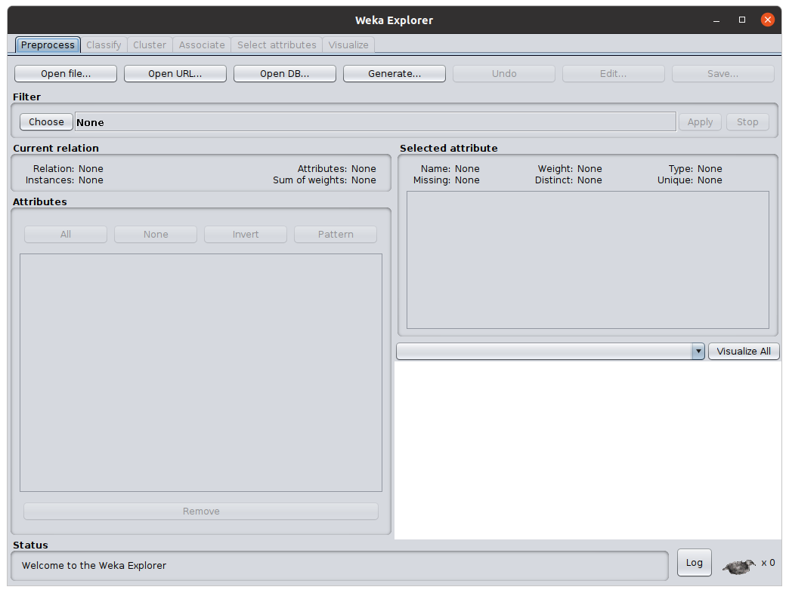
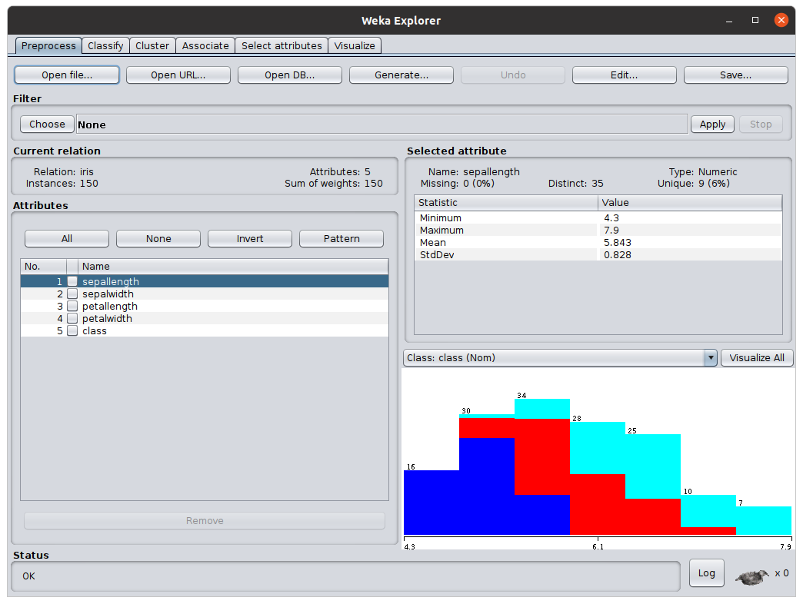
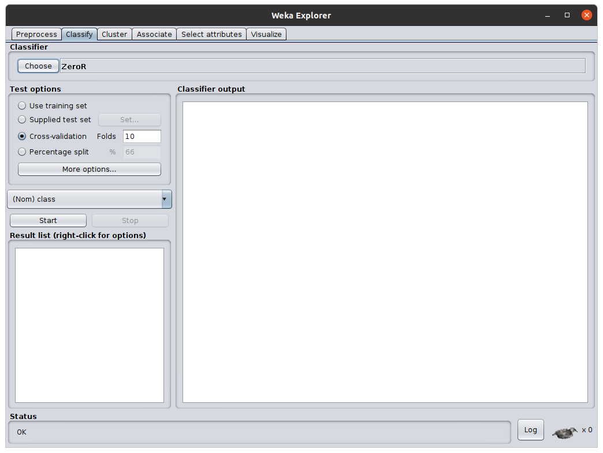
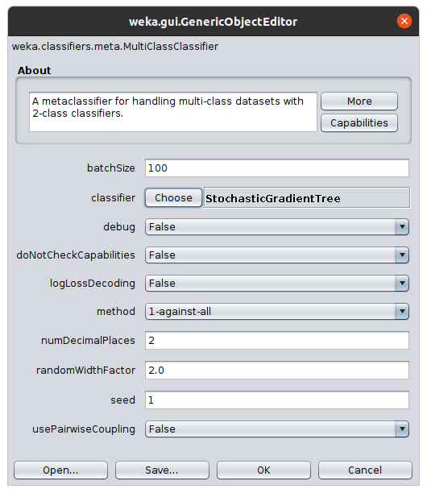
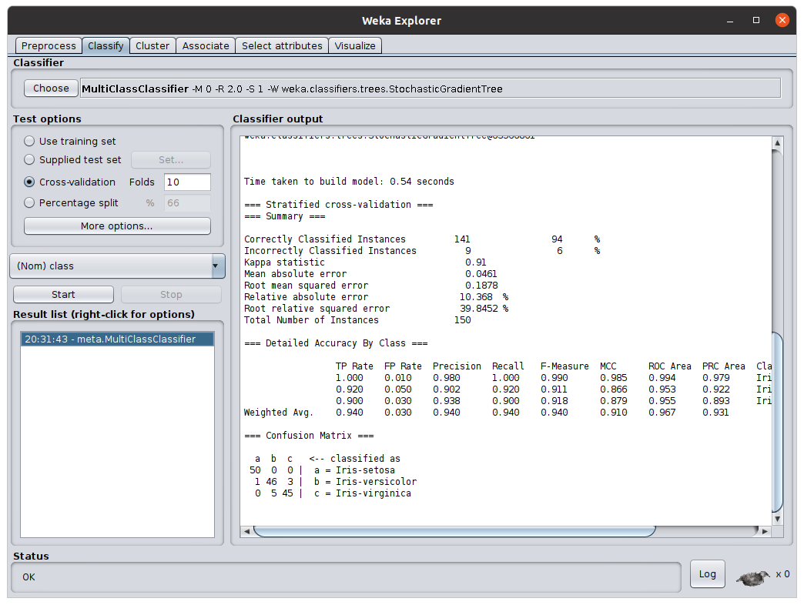

Stochastic Gradient Trees
=========================

This repo contains an implementation of the techniques described in the paper [Stochastic Gradient Trees](https://arxiv.org/abs/1901.07777) by Henry Gouk, Bernhard Pfahringer, and Eibe Frank, and presented at ACML 2019. If you build on this work in your research please cite

```
@inproceedings{gouk2019stochastic,
  title={Stochastic Gradient Trees},
  author={Gouk, Henry and Pfahringer, Bernhard and Frank, Eibe},
  booktitle={Asian Conference on Machine Learning},
  pages={1094--1109},
  year={2019}
}
```

Usage
-----

The easiest way to get started is to use the gradle build system to automatically download the dependencies, compile the SGT code, and run a graphical user interface. For example, one can use the Weka framework by running this command in a unix-like terminal

```
./gradlew -Pui=weka run
```

Alternative values for the `-Pui` option are `meka`, which will launch a variant of Weka for multi-label learning, and `moa`, which will run the MOA data stream mining framework. Note that the first time you run one of these commands it may take a few minutes to download and compile the dependencies.

Weka Example
------------

Begin by running the gradle command given above. After the compilation process has finished, you should be presented with the "Weka GUI Chooser" window. Select the "Explorer" option to open the Weka Explorer:



From here, you can open a dataset by clicking the "Open file..." button in the top left. This will allow you, by default, to select an ARFF file containing tabular data. Note that other file formats can be selected from the drop down menu. If one were to open the Iris dataset distributed with Weka, then the Weka Explorer window would change to look like this:



Now click the "Classify" tab at the top of the window. This will allow you to select, train, and evaluate learning algorithms on the data you have loaded.



Click the "Choose" button in the top left and select the Weka > Classifiers > Meta > MultiClassClassifier option. This must be selected because the current SGT implementation in Weka does not directly support multi-class classification. After selecting this option, you will see that there is some text beside the "Choose" button. Click this text to open the classifier properties window.



For the "classifier" option, select Weka > Classifiers > Trees > StochasticGradientTree, and then click the "OK" button. You can now click the "Start" button on the left of the Explorer window to start running a 10-fold cross-validation evaluation of SGTs trained on the data you have loaded in. Once the training has finished, it should result in something like this:


